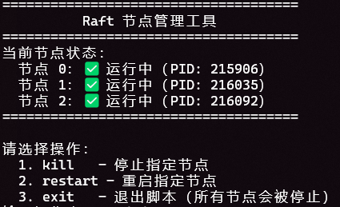
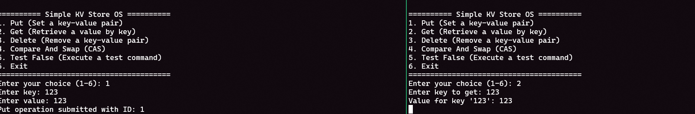
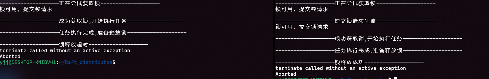

# Raft-RPC Distributed Consensus Framework

本项目是一个基于自定义高性能 RPC 库 (`Asio_mrpc`) 实现的 **通用 Raft 共识协议框架**。它旨在为分布式系统提供一套高可靠、高性能的状态一致性解决方案，使开发者能够轻松地在 Raft 协议之上构建各种分布式业务。

## 🎯 项目定位

不同于单一的分布式应用，本项目核心在于 **Raft 共识引擎的实现**。它提供了一套标准的状态机接口，支持多种分布式场景：
- **分布式 KV 存储** (已实现，作为第一个示例应用)
- **分布式锁服务** (已实现，支持带超时机制的分布式锁)
- **配置中心** (计划中)
- **分布式任务调度** (计划中)

## 🌟 核心特性

- **模块化 Raft 引擎**:
  - **解耦设计**: Raft 核心逻辑与底层通信层、上层业务状态机完全解耦。
  - **高性能通信**: 基于 `Asio_mrpc`（底层使用 Boost.Asio），支持高效的异步 RPC 调用。
  - **标准的 Raft 协议**: 完整实现领导者选举、日志复制、心跳维护及安全性约束。
- **易扩展的状态机接口**: 通过简单的回调机制即可接入不同的业务逻辑。
- **多场景支持**: 项目结构设计支持在 `example/` 下扩展多个独立的分布式业务案例。

## 📂 项目结构

```text
.
├── Asio_mrpc/          # 底层高性能 RPC 库 (依赖 Boost.Asio)
├── raftnode.cpp/hpp    # Raft 共识引擎核心逻辑实现 (重点)
├── struct.hpp          # Raft RPC 消息结构体定义
├── call_back.hpp       # 回调函数注册与管理工具类
├── example/            # 基于 Raft 引擎构建的分布式业务案例
│   ├── kv_store.cpp    # 案例 1: 交互式 KV 存储系统
│   ├── distributed_lock.cpp  # 案例 2: 分布式锁服务（支持超时机制）
│   ├── config_center.cpp     # 案例 3: 分布式配置中心（支持配置监听）
│   ├── task_scheduler.cpp    # 案例 4: 分布式任务调度系统
│   ├── node.cpp        # 通用 Raft 节点实现（用于 run.sh 管理）
│   ├── client.cpp      # 通用测试客户端
│   ├── server.cpp      # 通用测试服务端
│   └── test_callback.cpp     # 回调函数测试示例
├── run.sh              # 节点管理工具脚本
└── stop.sh             # 停止所有节点的脚本
```

## 🛠️ 环境依赖

- **编译器**: 支持 C++17 或更高版本的 GCC/Clang。
- **构建工具**: CMake (>= 3.13)。
- **核心依赖**:
  - `Asio`: 高性能异步网络 IO。
  - `spdlog`: 高性能日志记录库。
  - `nlohmann/json`: 数据序列化。
  - `Threads`: 系统线程支持。

##  Raft 引擎原理

本项目严格遵循 Raft 论文设计，确保集群在网络分区、节点故障等异常情况下的强一致性：
1. **选举机制**: 采用随机超时避免选票瓜分，确保快速选出新领导者。
2. **复制协议**: 日志在多数派节点写入成功后，才会提交至状态机应用。
3. **状态机抽象**: `RaftNode` 通过 `set_apply_callback` 与业务逻辑交互，实现"一次共识，多处应用"。

## 4. 验证 Raft 实现

使用 `run.sh` 脚本管理节点：
```bash
mkdir build && cd build
cmake ..
make -j
./run.sh
```

此脚本提供交互式管理界面，可用于：
- **查看节点状态**：显示当前所有节点的运行状态和PID
- **停止指定节点**：模拟节点故障
- **重启指定节点**：模拟节点恢复
- **退出脚本**：停止所有节点



通过此工具，您可以：
1. 随意杀死和启动节点
2. 观察日志变化来验证 Raft 协议的容错能力
3. 测试网络分区、节点故障等异常情况下的一致性保证
4. 根据logs/node*.log来查看节点日志，验证Raft协议的正确性
## 🚧 分布式应用实现路线图 (Roadmap)

- [x] **Raft 核心框架实现**
- [x] **[示例应用: 分布式 KV 存储](#kv-store-guide)**
- [x] **[业务扩展: 实现分布式锁服务（支持超时机制）](#distributed-lock-guide)**
- [x] **[业务扩展: 实现分布式配置中心（支持配置监听）](#config-center-guide)**
- [x] **[业务扩展: 实现分布式任务调度系统](#task-scheduler-guide)**
- [ ] **性能优化**: 接入磁盘持久化 (`save_state`/`load_state`)。
- [ ] **功能增强**: 实现日志压缩 (Snapshotting)。

## 🚀 快速开始 (以 KV 存储为例) {#kv-store-guide}

### 1. 启动 KV 存储集群

打开多个终端，分别启动不同节点：

```bash
# 终端 1: 启动节点 0
./bin/kv_store 0 127.0.0.1 8000 2 127.0.0.1:8001 127.0.0.1:8002

# 终端 2: 启动节点 1
./bin/kv_store 1 127.0.0.1 8001 2 127.0.0.1:8000 127.0.0.1:8002

# 终端 3: 启动节点 2
./bin/kv_store 2 127.0.0.1 8002 2 127.0.0.1:8000 127.0.0.1:8001
```

### 3. 交互体验

进入节点交互界面进行分布式 KV 操作：

----你可以在node0创建键值对，node1查询键值对，node2删除并查询键值对

## 🚀 分布式锁使用指南 {#distributed-lock-guide}

### 1. 启动分布式锁集群

打开多个终端，分别启动不同节点：

```bash
# 终端 1: 启动节点 0
./bin/distributed_lock 0 127.0.0.1 8000 2 127.0.0.1:8001

# 终端 2: 启动节点 1
./bin/distributed_lock 1 127.0.0.1 8001 2 127.0.0.1:8000
```

### 3. 锁操作流程

1. **获取锁**：节点会尝试获取分布式锁，成功后执行耗时任务
2. **锁竞争**：当一个节点持有锁时，其他节点会等待锁释放
3. **自动释放**：锁会在指定的超时时间后自动释放
4. **手动释放**：任务完成后会手动释放锁

### 4. 查看日志

查看节点日志了解锁操作详情：
```bash
cat logs/raft_node_0.log
```

## 🚀 分布式配置中心使用指南 {#config-center-guide}

### 1. 启动配置中心集群

打开多个终端，分别启动不同节点：

```bash
# 终端 1: 启动节点 0
./bin/config_center 0 127.0.0.1 8000 2 127.0.0.1:8001

# 终端 2: 启动节点 1
./bin/config_center 1 127.0.0.1 8001 2 127.0.0.1:8000
```

### 2. 配置中心功能

配置中心提供以下核心功能：

- **SET**: 设置配置项（支持新增和修改）
- **GET**: 查询配置项的值
- **DELETE**: 删除配置项
- **LIST**: 列出所有配置项
- **VERSION**: 查询配置项的版本号

### 3. 配置监听机制

配置中心支持配置变更监听，使用 `RegisterCallback` 接口注册回调函数：

```cpp
// 使用 lambda 注册配置变更监听器
g_config_center.WATCH_SET("database", [](const std::string& key, const std::string& value) {
    std::cout << "数据库地址已更新: " << value << std::endl;
});

g_config_center.WATCH_DELETE("database", [](const std::string& key) {
    std::cout << "数据库地址已删除: " << key << std::endl;
});
```


## 🚀 分布式任务调度系统使用指南 {#task-scheduler-guide}

### 1. 启动任务调度系统集群

打开多个终端，分别启动不同节点：

```bash
# 终端 1: 启动节点 0
./bin/task_scheduler 0 127.0.0.1 8000 2 127.0.0.1:8001

# 终端 2: 启动节点 1
./bin/task_scheduler 1 127.0.0.1 8001 2 127.0.0.1:8000
```

### 2. 任务调度系统功能

任务调度系统提供以下核心功能：

- **SUBMIT**: 提交新任务（支持设置任务类型、描述和优先级）
- **STATUS**: 查看任务状态
- **CANCEL**: 取消任务（只能取消待处理状态的任务）
- **LIST**: 列出所有任务
- **RUN**: 模拟执行任务（标记任务开始和完成）

### 3. 任务状态流转

任务状态流转：
- **pending**: 任务已提交，等待执行
- **running**: 任务正在执行中
- **completed**: 任务执行完成
- **cancelled**: 任务已取消

### 4. 交互式操作

启动后会进入交互式操作界面：

```
=====================================
         任务调度系统操作界面           
=====================================
  1. SUBMIT - 提交新任务               
  2. STATUS - 查看任务状态             
  3. CANCEL - 取消任务                 
  4. LIST   - 列出所有任务             
  5. RUN    - 模拟执行任务             
  0. EXIT   - 退出操作界面             
=====================================
```

### 5. 核心特性

- **强一致性**: 基于 Raft 协议，确保所有节点的任务状态一致
- **优先级管理**: 支持设置任务优先级（1-5，5最高）
- **任务状态管理**: 完整的任务生命周期管理
- **实时状态查询**: 随时查看任务的当前状态

### 6. 应用场景

- **分布式任务队列**: 管理和调度分布式系统中的任务
- **作业调度**: 定时或手动触发各种作业
- **工作流管理**: 协调多个相关任务的执行顺序
- **资源分配**: 基于优先级分配系统资源

## 🤝 贡献与反馈

如果你有新的分布式业务场景想法，欢迎通过 Issue 或 Pull Request 提交！

---
*本项目基于个人开发的 [mrpc](https://github.com/yjjj11/Asio_mrpc) 库构建。*