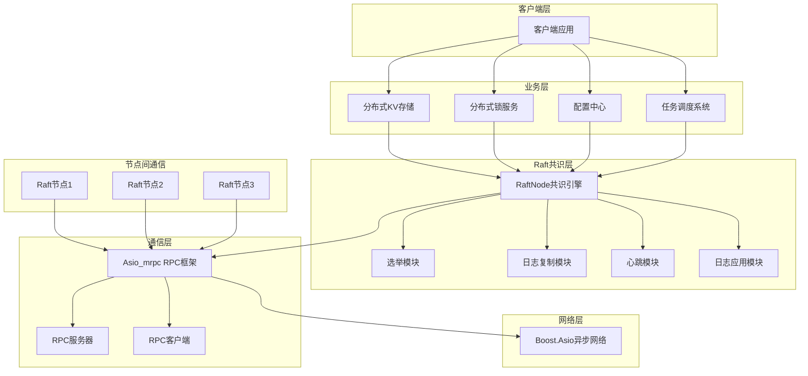

# 面试准备

## 请为当前Raft实现画一个架构图

架构说明：
- **客户端层**：提供各种分布式服务的客户端接口
- **业务层**：基于Raft构建的具体分布式应用（KV存储、锁服务等）
- **Raft共识层**：核心共识算法实现，包含选举、日志复制、心跳和应用四大模块
- **通信层**：自研Asio_mrpc框架，提供高效的RPC通信能力
- **网络层**：基于Boost.Asio的异步网络IO
- **节点间通信**：集群中多个Raft节点通过RPC进行通信

## 一，当前raft的处理流程是怎么样的

### 1. 节点启动流程
1. RaftNode构造函数初始化：设置节点ID、IP端口、集群配置
2. 加载持久化状态（任期、投票信息）
3. 设置RPC处理器：注册vote_request、append_request等RPC方法
4. 启动RPC服务器，开始监听
5. 连接到其他节点，建立RPC客户端连接
6. 启动各个后台线程：
   - 选举超时监控线程（run_election_timeout）
   - 日志应用线程（run_apply_loop）

### 2. 选举流程
1. **Follower状态**：节点启动后默认为Follower，等待Leader心跳
2. **选举超时**：如果在election_elapsed_time（3000-4000ms随机）内未收到心跳：
   - 成为Candidate，递增任期
   - 给自己投票
   - 并行向所有节点发送VoteRequest
3. **投票处理**：收到VoteRequest后检查：
   - 请求任期是否最新
   - 是否已投票（同一任期内）
   - 日志是否足够新（lastLogTerm和lastLogIndex比较）
4. **成为Leader**：获得多数票（> total_nodes/2）后成为Leader
5. **心跳维护**：Leader定期发送心跳维持权威

### 3. 日志复制流程
1. **客户端提交**：客户端调用submit()提交LogEntry
2. **Leader处理**：
   - 如果不是Leader，转发给当前Leader
   - 添加日志到本地log_，返回request_id
3. **日志复制**：
   - Leader在心跳中携带待复制日志
   - Follower检查日志一致性（prevLogIndex和prevLogTerm）
   - 如果一致，追加日志，更新next_index和match_index
   - 如果不一致，拒绝追加，Leader递减next_index并重试
4. **日志提交**：
   - 当日志被多数节点复制，更新commit_index
   - 唤醒apply_thread异步应用日志

### 4. 日志应用流程
1. **异步应用**：apply_thread独立于共识逻辑
2. **回调执行**：
   - 根据command_type查找注册的回调函数
   - 执行业务逻辑（如KV的Put/Get操作）
3. **状态更新**：
   - 更新last_applied
   - 通知等待的客户端（通过promise/future）
4. **错误处理**：如果回调未注册，停止应用以保证一致性

### 5. 故障恢复流程
1. **节点故障**：连接超时，标记节点下线，减少total_nodes_count
2. **Leader故障**：Follower选举超时，发起新选举
3. **网络分区**：分区内选举新Leader，分区恢复后高任期Leader赢得选举
4. **日志不一致**：新Leader通过AppendEntries强制同步日志

### 6. 业务集成流程
1. **注册回调**：业务层通过reg_callback注册命令处理器
2. **提交操作**：业务调用submit()提交操作日志
3. **等待结果**：通过wait_for()等待共识完成
4. **监听变更**：通过WATCH机制监听特定Key的变化##

## 二，你在开发过程中遇到过什么问题么？

#### 1. 异步日志应用阻塞问题
- **问题**：在加入业务逻辑前我检测纯raft实现时一般不会涉及到日志应用线程，所以一开始我是将日志应用的逻辑放在心跳线程中的，也就是发送所有心跳并检测是否可以提交后。当我实现了一个最简单的睡眠两秒的任务后，我发现我的集群开始胡乱选举。就是因为心跳线程被阻塞了，导致其他节点选举超时，变为了candidate
- **解决方法**：加入了日志应用线程，通过条件变量在心跳线程和日志应用线程之间传递日志应用信息，实现异步处理。

#### 2. 线性一致性读优化问题
- **问题**：开始时实现的业务操作都是通过raft的submit接口提交，然后等待日志应用，对客户端来说也就是异步的应用。但是如果提交后我希望立马查询这个key的值，就会产生错误。因为可能会读到key应用之前的值。
- **解决方法**：所以我决定为raft的submit加上req_id，并且这个req_id只有leader节点可以产生，保证集群内全局req_id统一。然后为对应的req_id在本地保存一个对应的promise，逻辑上就上增添了一个异步转同步的可能性。可以自己决定走异步还是同步，类似于读取的操作可以加入一个barrier日志并等待应用后再本地读
- **优化**：通过ReadIndex机制：客户端提交barrier提交后不进行日志复制，而是把req_id和当时的commit_index加入raft的等待列表，当last_applyed赶上了这个commit_index之后再返回。减少了读请求在集群间传输和日志复制的开销，优化了读性能。

#### 3. 故障恢复时回调未注册问题
- **问题**：当我实现kv存储实例并测试故障恢复时，我发现节点恢复时日志中出现大量对应操作未注册的报错信息。我意识到这是因为raft的选举线程和日志应用线程要比kv的回调注册更早初始化，导致节点间已经开始日志应用了但是kv回调还没注册好，那么节点重新上线之后虽然日志已经同步了，但是因为应用时未执行任何对应操作，状态实际上为空。
- **解决方法**：在raft的日志应用线程中不应用last_applied到最新复制的日志index，因为后续每一次异步日志应用线程被唤醒时都会从last——applyed开始应用。

### 三，请在下方列出可能提问的问题以及合适的回答

#### 1. Raft算法的核心是什么？这个实现有什么特点？
Raft是一种分布式一致性算法，用于解决分布式系统中的数据一致性问题。其核心是Leader选举、日志复制和安全性保证。这个实现的特点：
- 基于自研高性能RPC框架Asio_mrpc，异步通信效率高
- 解耦设计：共识逻辑与业务逻辑分离，避免阻塞
- 异步日志应用：通过独立apply_thread防止耗时业务影响心跳
- 状态机抽象：通过回调机制支持多种分布式应用

#### 2. 如何保证日志的一致性？
通过以下机制：
- Leader选举时进行日志完整性检查（lastLogTerm和lastLogIndex）
- AppendEntries RPC中的一致性检查（prevLogIndex和prevLogTerm）
- 日志覆盖：Follower发现冲突时删除后续日志并追加Leader日志
- 提交规则：日志必须被多数节点复制后才提交

#### 3. 如何处理网络分区和节点故障？
- 网络分区：分区内选举新Leader，保证可用性；分区恢复后高任期Leader重新赢得选举
- 节点故障：通过心跳检测，连接超时标记节点下线；选举超时触发重选
- 动态集群：total_nodes_count动态调整，适应节点上下线

#### 4. 为什么需要异步日志应用？如何实现的？
同步应用会阻塞心跳线程，导致选举超时。通过独立apply_thread异步应用：
- 共识与业务解耦，提高系统响应性
- 批量应用日志，提高效率
- 错误处理：回调失败时停止应用，保证一致性
- 通知机制：通过promise/future通知客户端操作结果

#### 5. 如何支持多种分布式应用？
通过可插拔状态机设计：
- 统一的LogEntry格式：command_type + JSON参数
- 回调注册：业务层注册命令处理器
- 监听机制：WATCH支持事件驱动
- 示例实现：KV存储、分布式锁、配置中心、任务调度

#### 6. RPC框架的设计亮点是什么？
Asio_mrpc是自研高性能RPC框架：
- 基于Boost.Asio异步网络IO
- 支持多种调用模式：同步、异步、协程
- 自动序列化：使用nlohmann/json
- 连接管理：自动重连和故障检测

#### 7. 如何处理脑裂问题？
Raft通过任期机制防止脑裂：
- 每个任期最多一个Leader
- 旧任期消息被拒绝
- 分区恢复时，只有高任期节点能赢得选举